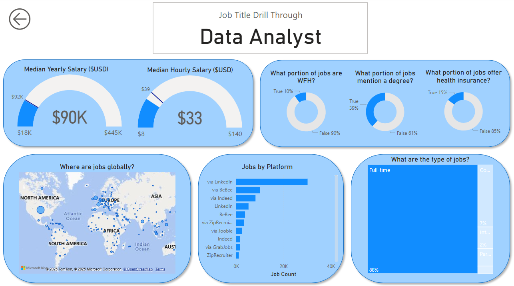
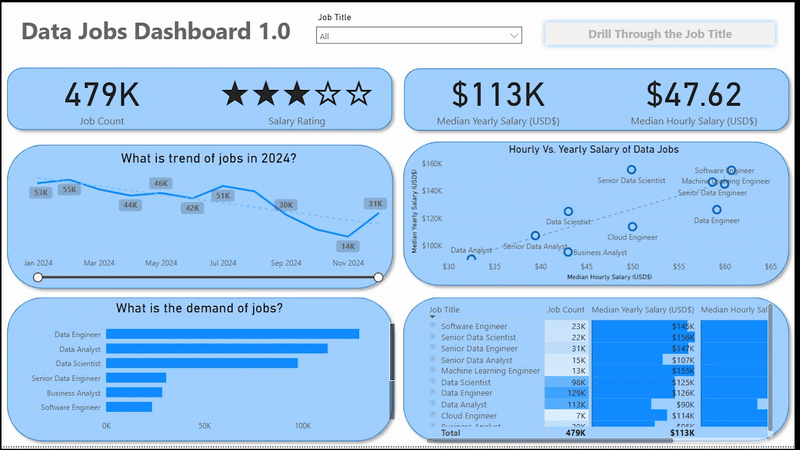

# Data Job Market Insights (v1.0)

  
  

---

## Project Overview

This Power BI dashboard was created to help professionals navigate the growing data job market more effectively. Aimed at individuals exploring job changes or entering the data field, it transforms complex job posting data from 2024 into an accessible and interactive experience. From job titles and salaries to global demand trends, this report simplifies it all in a clean two-page layout.

> Power BI File: [`G-Drive Link`](https://drive.google.com/file/d/1YoETddP_JcNcjW_-670uFS_P4Do9Teag/view?usp=sharing)

---

## Features & Techniques Demonstrated

This project provided a hands-on opportunity to apply and enhance multiple Power BI skills:

- **ETL with Power Query:** Cleaned and structured the dataset by handling null values, adjusting data types, and creating new columns for richer analysis.
- **Measures & KPIs:** Built measures like `Median Salary`, `Job Count`, and distribution metrics using implicit DAX.
- **Visualization Techniques:**
  - Standard visuals: Column, Bar, Line, and Area Charts
  - Geospatial analysis using Map Charts
  - Cards for headline KPIs and detailed, sortable Tables
- **Report Layout & UI Design:** Focused on creating a polished, intuitive user experience with informative visuals.
- **Interactive Elements:**
  - Slicers for real-time filtering by job title
  - Navigation using buttons and bookmarks
  - Drill-through to explore deeper insights for individual job titles

---

## Dashboard Walkthrough

This Power BI report is designed as a **two-page experience** for easy exploration and deeper insights:

### Page 1: Market Summary

This overview provides quick stats on job counts, salary medians, trending job roles, and market distribution — a perfect starting point for decision-making.

---

### Page 2: Job-Specific Drillthrough

Drill into specific job titles for a detailed breakdown: salary ranges, remote job availability, top platforms hiring for that role, and a location-based map view.

---

## Final Thoughts

This dashboard demonstrates the power of data visualization in job market analytics. With just a few clicks, users can uncover patterns in hiring, salary distribution, and role-specific demand. Whether you're switching careers or just exploring the field, this tool is designed to give clear, actionable insight into the world of data jobs.
