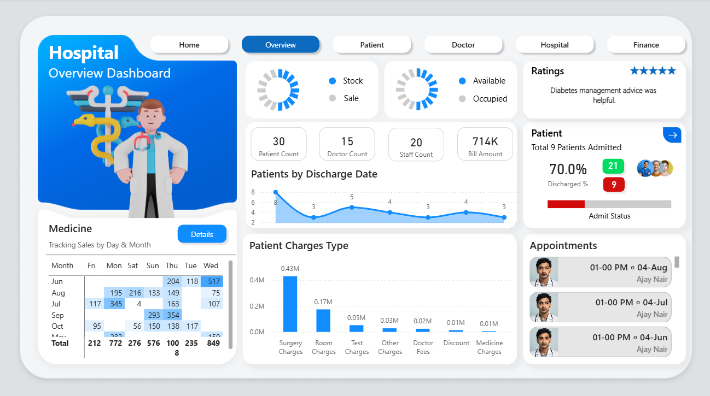

# Hospital Management Dashboard (v1.0)

  
  

---

## Project Overview

This Power BI project delivers a **comprehensive Hospital Management Dashboard** to track and analyze operational, financial, and patient-care metrics in real time. Built as a multi-page, interactive report, it empowers healthcare administrators to **monitor performance, optimize resources, and support data-driven decision-making**.  

> Power BI File: [`Hospital_Dashboard.pbix`](./hospital_dashboard.pbix)  

---

## Features & Techniques Demonstrated

This project showcases strong expertise in **data engineering, analytics, and visualization** using Power BI:  

- **Data Preparation (Power Query):**  
  - Cleaned and standardized raw hospital datasets  
  - Handled null values, merged multiple sources, and added calculated columns for richer analysis  
- **Data Modeling:**  
  - Designed a **star schema** with clear relationships between facts (patient admissions, billing) and dimensions (doctors, dates, departments)  
  - Built optimized measures and KPIs using **DAX** for performance metrics  
- **Dashboard Design:**  
  - Multi-page navigation with a **custom home page and clickable buttons**  
  - KPI cards, bar/line charts, and a matrix-style **heatmap** for department-level analysis  
  - Color-coded indicators for **bed occupancy, discharge rates, and patient statuses**  
- **Interactive Elements:**  
  - Page navigation, slicers, and drill-through filters for dynamic exploration  
  - Custom visuals to enhance storytelling and highlight critical metrics  
- **Business Value:**  
  - Centralized reporting system to monitor hospital operations and improve decision-making efficiency  

---

## Dashboard Walkthrough

This dashboard is structured into **five core pages**, each focused on a different operational area:  

### 🏠 Home Page
  
A clean landing page with intuitive **navigation buttons** to different dashboards: Overview, Patient, Doctor, Hospital, and Finance.  

---

### 📊 Overview Dashboard
  
- KPIs: Patient count, doctor count, staff count, total billing amount  
- Charts: Patient discharge trends, charges breakdown, appointments list  
- Widgets: Ratings, admit/discharge percentages, occupancy vs availability  

---

### 🧍‍♂️ Patient Dashboard
*(Insert screenshot here)*  
- Patient demographics, admission trends, discharge summaries  
- Drillable charts for **age, gender, and treatment category analysis**  

---

### 🩺 Doctor Dashboard
*(Insert screenshot here)*  
- Doctor-wise performance metrics, specialization distribution, appointment history  

---

### 🏥 Hospital Operations
*(Insert screenshot here)*  
- Bed occupancy and resource utilization rates  
- Department-level capacity and operational performance tracking  

---

### 💰 Finance Dashboard
*(Insert screenshot here)*  
- Revenue streams by department, billing trends, and outstanding balances  
- Expense vs. revenue comparisons for budget planning  

---

## Final Thoughts

This project demonstrates **end-to-end Power BI expertise**, from **ETL and modeling** to **UI design and advanced visual analytics**. While focused on healthcare, these skills are **transferable to banking, finance, and corporate analytics**, making it a strong showcase of:  

- **Business Analysis:** KPI tracking, process optimization, decision support  
- **Data Analytics:** Data transformation, modeling, and reporting on large datasets  
- **Visualization:** Professional dashboards with a strong focus on usability and insights  
