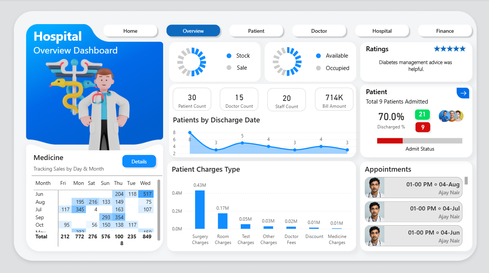
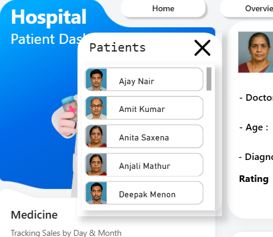

# Hospital Management Dashboard (v1.0)

  

---

## Project Overview

This Power BI project delivers a **comprehensive Hospital Management Dashboard** to track and analyze operational, financial, and patient-care metrics in real time. Built as a multi-page, interactive report, it empowers healthcare administrators to **monitor performance, optimize resources, and support data-driven decision-making**.  

> Power BI File: [`Hospital_Dashboard.pbix`](https://drive.google.com/file/d/142lkD6RZatW8qBpdayymcgUFkU86fb0b/view?usp=sharing)  

---

## Features & Techniques Demonstrated

This project showcases strong expertise in **data engineering, analytics, and visualization** using Power BI:  

- **Data Preparation (Power Query):**  
  - Cleaned and standardized raw hospital datasets  
  - Handled null values, merged multiple sources, and added calculated columns for richer analysis  
- **Data Modeling:**  
  - Designed a **star schema** with clear relationships between facts (patient admissions, billing) and dimensions (doctors, dates, departments)  
  - Built optimized measures and KPIs using **DAX** for performance metrics  
- **Dashboard Design:**  
  - Multi-page navigation with a **custom home page and clickable buttons**  
  - KPI cards, bar/line charts, and a matrix-style **heatmap** for department-level analysis  
  - Color-coded indicators for **bed occupancy, discharge rates, and patient statuses**  
- **Interactive Elements:**  
  - Page navigation, slicers, and drill-through filters for dynamic exploration  
  - Custom visuals to enhance storytelling and highlight critical metrics  
- **Business Value:**  
  - Centralized reporting system to monitor hospital operations and improve decision-making efficiency  

---

## Dashboard Walkthrough

This dashboard is structured into **five core pages**, each focused on a different operational area:  

### 🏠 Home Page
  

A clean landing page with intuitive **navigation buttons** to different dashboards: Overview, Patient, Doctor, Hospital, and Finance.  

---

### 📊 Overview Dashboard
 

- KPIs: Patient count, doctor count, staff count, total billing amount  
- Charts: Patient discharge trends, charges breakdown, appointments list  
- Widgets: Ratings, admit/discharge percentages, occupancy vs availability  

---

### 🧍‍♂️ Patient Dashboard
  

- Developed patient profiles displaying demographics, medical details, and billing history.
- Implemented medicine sales tracking by day and month for deeper pharmacy insights.
- Visualized charges breakdown (room, doctor, medicine, surgery, etc.) with interactive bars.
- Enabled admission and discharge monitoring for better hospital flow management.
- Designed patient-wise KPIs such as total bill amount and medicine quantities.

  

- Added a patient name slicer to quickly filter dashboards for individual patient details, billing, and medical history.
- Tools - Visual Slicer, Bookmarks

---

### 🩺 Doctor Dashboard
   

- Built doctor profiles with specialization, experience, qualifications, and ratings.
- Created appointment tracking with upcoming schedules displayed in real-time.
- Integrated a commission calculator with sliders to dynamically adjust commission rates and patient spend.
- Displayed earnings, patient spend, and doctor status via interactive KPI cards.
- Linked doctor performance to patient outcomes and billing for efficiency analysis.

  

- Integrated a doctor name slicer to analyze performance, appointments, and earnings at a doctor-specific level.
- Tools - Visual Slicer, Bookmarks

---

### 🏥 Hospital Operations
 

- Implemented a surgery appointments slicer to filter and analyze hospital operations by scheduled procedures.
- Designed a patient age distribution bar chart for demographic insights.
- Created a stacked bar chart to monitor bed counts vs availability, enabling resource optimization.
- Built a medical tests record tracker to capture diagnostic data across patients.
- Integrated doctor appointment scheduling visuals for hospital workflow management. 

---

### 💰 Finance Dashboard
 

- Developed a heatmap visualization to track monthly medicine sales trends.
- Analyzed charge types (surgery, room, doctor fees, tests, medicines, etc.) with detailed breakdowns.
- Built medicine inventory tracking to monitor stock levels and consumption rates.
- Designed a supplier-wise sales and stock tracker for supply chain visibility.
- Highlighted key KPIs including patient count, doctor/staff count, patient ratings, total bill amount, and salary expenses.

---

## Final Thoughts

This project demonstrates **end-to-end Power BI expertise**, from **ETL and modeling** to **UI design and advanced visual analytics**. While focused on healthcare, these skills are **transferable to banking, finance, and corporate analytics**, making it a strong showcase of:  

- **Business Analysis:** KPI tracking, process optimization, decision support  
- **Data Analytics:** Data transformation, modeling, and reporting on large datasets  
- **Visualization:** Professional dashboards with a strong focus on usability and insights  
